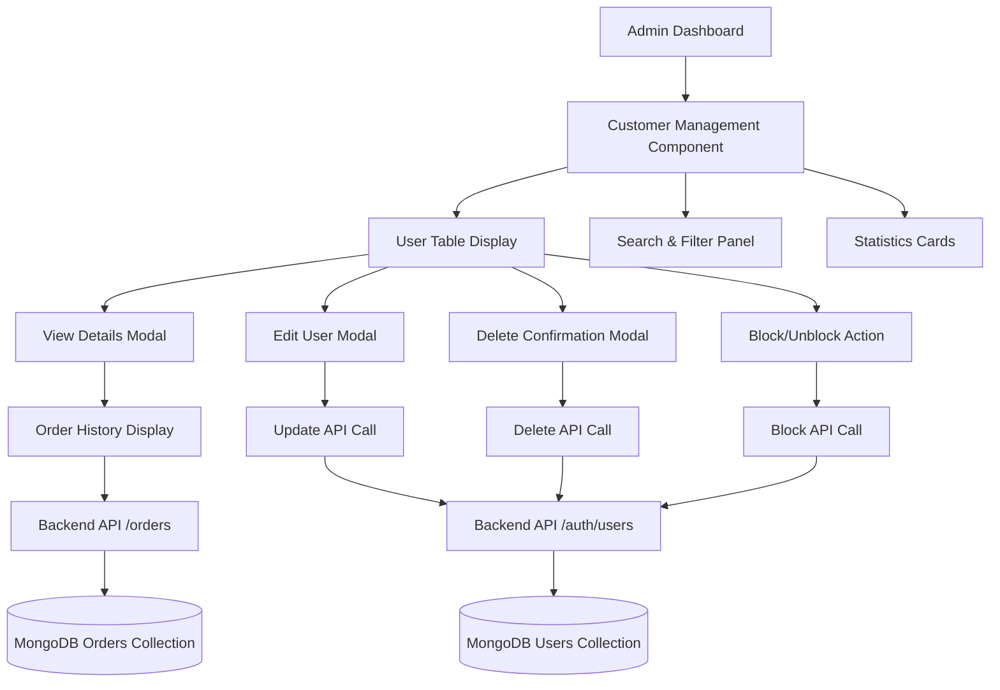
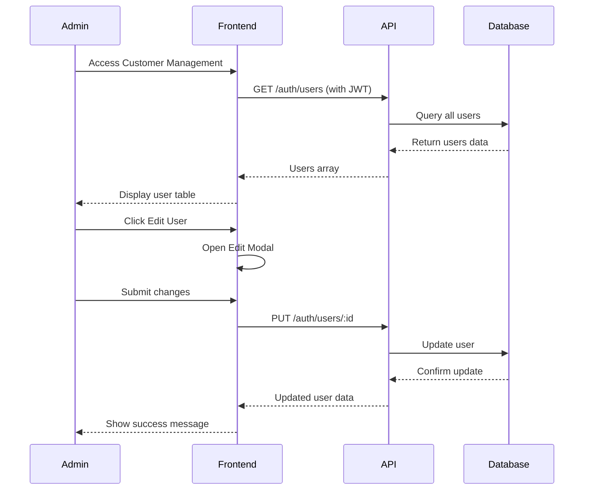
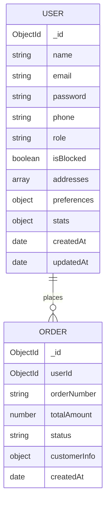
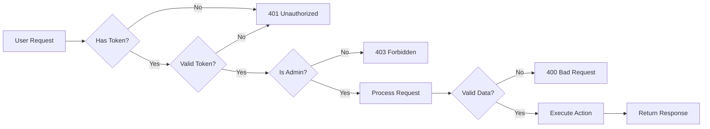
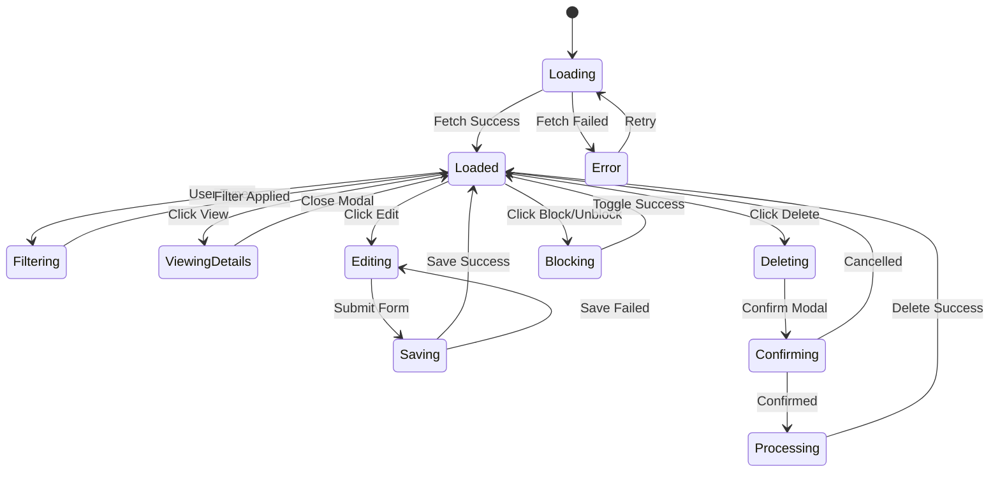

# Customer Management - Architecture & Flow

## System Architecture



## Data Flow Diagram



## Component Structure

```
CustomerManagement
├── State Management
│   ├── customers (array)
│   ├── filteredCustomers (array)
│   ├── searchTerm (string)
│   ├── statusFilter (string)
│   ├── roleFilter (string)
│   ├── loading (boolean)
│   ├── error (string)
│   └── modals (showModal, showEditModal, showDeleteModal)
│
├── Data Fetching
│   ├── fetchCustomers()
│   └── fetchCustomerOrders()
│
├── User Actions
│   ├── handleViewCustomer()
│   ├── handleEditCustomer()
│   ├── handleUpdateCustomer()
│   ├── handleDeleteCustomer()
│   ├── confirmDelete()
│   └── handleToggleBlock()
│
├── UI Components
│   ├── Statistics Cards
│   ├── Search & Filter Bar
│   ├── User Table
│   └── Modals
│       ├── CustomerDetailModal
│       ├── EditCustomerModal
│       └── DeleteConfirmationModal
│
└── Utilities
    ├── getStatusColor()
    └── getRoleDisplayName()
```

## Backend API Architecture

```
Auth Routes (/api/auth)
├── Authentication Middleware
│   ├── protect (JWT verification)
│   └── isAdmin (Role check)
│
├── User Management Endpoints
│   ├── GET /users
│   │   ├── Query: role, search, status
│   │   └── Response: { users: [] }
│   │
│   ├── GET /users/:id
│   │   └── Response: User object
│   │
│   ├── PUT /users/:id
│   │   ├── Body: user data
│   │   └── Response: { message, user }
│   │
│   ├── DELETE /users/:id
│   │   └── Response: { message }
│   │
│   ├── PATCH /users/:id/block
│   │   ├── Body: { isBlocked }
│   │   └── Response: { message, user }
│   │
│   └── GET /users/:id/orders
│       └── Response: { orders: [] }
│
└── Error Handling
    ├── User not found (404)
    ├── Email already exists (400)
    └── Server error (500)
```

## Database Schema Relations



## Security Flow



## Feature Integration Points

### Integrates With:
1. **Authentication System** - Admin login/JWT
2. **Order Management** - User order history
3. **User Profile** - User data management
4. **Dashboard** - Admin dashboard navigation

### Dependencies:
- React (Frontend framework)
- Express (Backend framework)
- MongoDB (Database)
- JWT (Authentication)
- Heroicons (UI icons)
- Tailwind CSS (Styling)

## State Management Flow



## API Response Flow

### Success Response
```
Request → Middleware Check → Database Operation → Success Response
   ↓            ↓                    ↓                    ↓
  JWT       IsAdmin?            MongoDB              200 OK
Validate    Check              Update/Query         + Data
```

### Error Response
```
Request → Middleware Check → Error Detected → Error Response
   ↓            ↓                  ↓               ↓
  JWT       IsAdmin?          Validation      400/401/403/404/500
Validate    Check              Failed          + Error Message
```

## Performance Considerations

1. **Data Fetching**: Single API call loads all users
2. **Client-Side Filtering**: Fast search/filter without API calls
3. **Lazy Loading Orders**: Orders fetched only when viewing details
4. **Optimistic Updates**: UI updates before confirmation for better UX
5. **Error Recovery**: Graceful error handling with retry options

## Scalability Notes

**Current Implementation**: Loads all users at once  
**Future Optimization**: 
- Implement pagination (50-100 users per page)
- Server-side search for large datasets
- Caching strategies for frequently accessed data
- Debounced search for API efficiency
